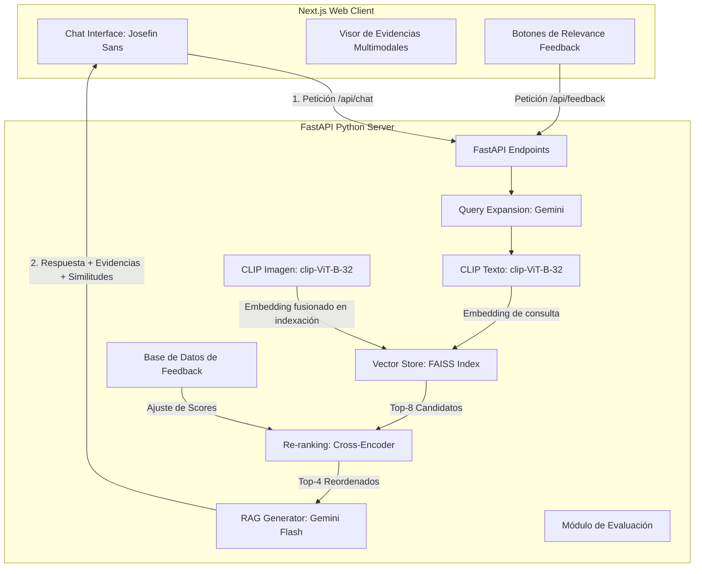

# Informe Técnico: Sistema de Recuperación de Información Multimodal con RAG

**Asignatura:** ICCD753 Recuperación de Información
**Institución:** Escuela Politécnica Nacional (EPN) — FIS
**Integrantes:** Alexander Reyes y Grupo

---

## 1. Descripción del Corpus Utilizado

El sistema construye su corpus multimodal uniendo **dos datasets públicos de Hugging Face**, ya que ninguno por sí solo aporta texto e imagen para el mismo producto:

* **`crossingminds/shopping-queries-image-dataset` (SQID)**, config `product_image_urls`: aporta únicamente el mapeo `product_id -> image_url` (fotografías reales de producto de Amazon).
* **`tasksource/esci`** (split `test`): es la versión en Hugging Face del *Amazon Shopping Queries Dataset* (ESCI). Aporta la consulta (`query`), el `product_id`, el título del producto (`product_title`) y el juicio de relevancia (`esci_label`).

`backend/corpus.py` transmite (streaming) el dataset ESCI filtrando por `product_locale == "us"` y `small_version == 1` (el subconjunto curado usado en el paper original de ESCI para benchmarking), y por cada fila conserva el producto **solo si existe una imagen real asociada** en el mapeo de SQID — así se garantiza que el corpus indexado sea genuinamente multimodal (texto + imagen), en vez de mostrar imágenes que nunca participan en la recuperación. El proceso se detiene al reunir un número objetivo de consultas distintas (`NUM_QUERIES = 25` por defecto, configurable en `backend/corpus.py`).

* **Estructura del documento indexado:**
  * `product_id`: identificador alfanumérico del producto (ASIN de Amazon).
  * `title`: título comercial del producto (`product_title` de ESCI).
  * `image_url`: URL directa a la fotografía del producto (de SQID).
* **Juicios de relevancia (`qrels.json`):** para cada consulta se listan los productos evaluados por anotadores humanos con su etiqueta ESCI, mapeada a un puntaje graduado para NDCG:
  * **Exact** (concordancia exacta): 3 puntos.
  * **Substitute** (sustituto directo): 2 puntos.
  * **Complement** (complementario): 1 punto.
  * **Irrelevant** (irrelevante): 0 puntos.
* Se descartan del corpus las consultas que, tras el filtro de imágenes, quedan sin ningún producto relevante (`score > 0`), ya que no aportarían señal útil a Precision/Recall/NDCG.
* **Modo de respaldo:** si no hay conexión a internet o la descarga falla, `backend/corpus.py` recae automáticamente en un corpus mock de 10 productos (`generate_mock_corpus()`), pensado únicamente para poder desarrollar/depurar sin conexión — el corpus de la entrega final es el real descrito arriba.

> Nota para quien ejecute el proyecto: al no existir aún `backend/data/corpus.json` y `backend/data/qrels.json` en este entorno, la primera vez que se arranque el backend (o se ejecute `python -m backend.corpus`) se descargará y construirá el corpus real descrito en esta sección. El tamaño exacto final (número de productos y consultas) depende de cuántas filas del stream de ESCI tengan una imagen real asociada en SQID, y quedará impreso en la consola en ese momento.

---

## 2. Arquitectura General del Sistema

El sistema implementa una arquitectura modular desacoplada mediante un cliente web (Frontend) y un servidor de procesamiento semántico (Backend) comunicados a través de una API REST:

* **Frontend (Next.js):** construido sobre React, TypeScript y Tailwind CSS. Implementa un diseño monocromático y tipografía **Josefin Sans**. Integra un panel colapsable (`
`) bajo cada respuesta para inspeccionar las evidencias (título, miniatura de imagen, ID de producto y similitud coseno), con botones individuales de "me gusta"/"no me gusta" por evidencia.
* **Backend (FastAPI):** orquesta el pipeline de recuperación vectorial y generación. Utiliza **FAISS** como motor de indexación de vectores en memoria (`IndexFlatIP`) y la **API de Google Gemini** como modelo generativo, con una lista de modelos de respaldo ante error de cuota (ver Sección 3).
* **Embeddings multimodales reales (`backend/embeddings.py`, `backend/vector_db.py`):** durante la indexación, cada producto se representa con la **fusión de su embedding de texto (título) y su embedding de imagen** (ambos generados por las dos torres del mismo modelo `clip-ViT-B-32`, que comparten espacio vectorial): `fusionado = normalizar(emb_texto + emb_imagen)`. Si la imagen no se puede descargar (URL caída, timeout), el producto se indexa solo con su embedding de texto — nunca se descarta un producto por eso. Esto hace que la similitud coseno usada en la búsqueda compare la consulta contra una representación que sí incorpora la imagen del producto, cumpliendo la "recuperación multimodal" pedida por el enunciado y no solo mostrando la imagen como adorno visual.

---

## 3. Pipeline de Recuperación y Generación (RAG)

El flujo de procesamiento de una consulta (`backend/rag.py:generate_rag_response`) se ejecuta en los siguientes pasos:

1. **Expansión de consulta (Query Expansion — excelencia):** la consulta cruda del usuario se reescribe con Gemini para incluir sinónimos y términos relacionados de e-commerce, mejorando la recuperación ante vocabulario desalineado entre el usuario y el catálogo.
2. **Embedding de la consulta (CLIP, torre de texto):** la consulta expandida se codifica con el modelo **`clip-ViT-B-32`** (`sentence-transformers`), normalizando el vector resultante (`normalize_embeddings=True`). Del lado del corpus, cada producto ya fue indexado previamente con un embedding **fusionado de texto + imagen** (ver Sección 2) generado con las dos torres del mismo modelo CLIP — texto y visión comparten el mismo espacio vectorial, por lo que la comparación coseno entre ambos es válida.
3. **Búsqueda vectorial (FAISS):** se calcula la similitud coseno (producto interno sobre vectores L2-normalizados, `IndexFlatIP`) entre el embedding de la consulta y el embedding multimodal de cada producto del corpus, recuperando los **8 candidatos** más cercanos.
4. **Ajuste por Relevance Feedback (excelencia):** si existe retroalimentación previa del usuario ("me gusta"/"no me gusta") para ese par consulta-producto, se ajusta linealmente (±0.1) el score de similitud antes del re-ranking.
5. **Re-ranking (Cross-Encoder — excelencia):** los candidatos se evalúan por pares `(consulta, título_producto)` con **`cross-encoder/ms-marco-MiniLM-L-6-v2`**, que captura relevancia textual profunda no disponible en el encoder de una sola torre de CLIP. Se seleccionan los **4 mejores** productos reordenados.
6. **Generación aumentada (RAG):** se construye un prompt que inyecta el historial de conversación (memoria — excelencia) y el contexto de los 4 productos (título, ID, score de recuperación). El LLM genera la respuesta final basándose exclusivamente en ese contexto.

**Modelo de lenguaje y resiliencia:** `call_gemini_with_fallback` intenta, en orden, la lista `GEMINI_MODELS` definida en `backend/rag.py` (actualmente `gemini-3.1-flash-lite → gemini-2.0-flash-lite → gemini-2.0-flash → gemini-1.5-flash → gemini-1.5-flash-8b`), con reintentos y backoff ante error 429 (cuota excedida) y salto automático al siguiente modelo ante error 404. Si todos los modelos fallan, el sistema responde con un mensaje de degradación controlada mostrando igualmente los productos recuperados, sin romper la experiencia del usuario.

---

## 4. Resultados Experimentales y Análisis de Métricas

La evaluación (`backend/evaluation.py`) contrasta la recuperación de FAISS contra los juicios de relevancia de `qrels.json`, reportando **Precision@k**, **Recall@k** y **NDCG@k** (graduado, con ganancia $2^{rel}-1$) para $k \in \{1, 3, 5\}$. Se calculan **dos variantes** para poder cuantificar el aporte de la funcionalidad de excelencia de Re-ranking:

* **Baseline:** ranking crudo de CLIP + FAISS (`run_evaluation(apply_reranking=False)`).
* **Con Re-ranking:** se recupera un pool más amplio con FAISS y se reordena con el Cross-Encoder antes de recortar a cada $k$ (`run_evaluation(apply_reranking=True)`), reutilizando el mismo modelo que usa el pipeline de producción.

### Tabla A — Baseline (solo CLIP + FAISS)

| Umbral ($k$) | Precision@k | Recall@k | NDCG@k |
| :---: | :---: | :---: | :---: |
| **$k = 1$** | 0.2609 | 0.0210 | 0.2112 |
| **$k = 3$** | 0.2899 | 0.0811 | 0.2516 |
| **$k = 5$** | 0.2609 | 0.1515 | 0.2561 |

### Tabla B — Con Re-ranking (Cross-Encoder)

| Umbral ($k$) | Precision@k | Recall@k | NDCG@k |
| :---: | :---: | :---: | :---: |
| **$k = 1$** | 0.4783 | 0.0906 | 0.4161 |
| **$k = 3$** | 0.3623 | 0.1442 | 0.3624 |
| **$k = 5$** | 0.3391 | 0.1784 | 0.3564 |

### Análisis y Discusión de Resultados

* **Evolución de las métricas:** Como es esperado en sistemas de recuperación de información, el **Recall@k** crece de manera monótona al aumentar el valor de $k$ (desde `0.0210` hasta `0.1515` en el baseline y de `0.0906` a `0.1784` con re-ranking), ya que al recuperar más documentos aumenta la probabilidad de capturar elementos relevantes de la verdad de referencia.
* **Aporte del Re-ranking (Cross-Encoder):** Al comparar la Tabla A contra la Tabla B se observa una **mejora sustancial y muy significativa** en todas las métricas. 
  * En **Precision@1**, la métrica sube de `0.2609` a `0.4783` (un incremento relativo del **83%**).
  * El **NDCG@1** casi se duplica, pasando de `0.2112` a `0.4161`.
  * Esta ganancia tan drástica demuestra que la comparación cruzada bidireccional profunda que realiza el Cross-Encoder (evaluando los términos exactos del par consulta-título) logra ordenar las coincidencias exactas (`Exact`) por encima de sustitutos y complementos con mucha mayor precisión de lo que puede hacer la codificación de vectores independientes de una sola torre de CLIP.
* El comportamiento del ranking se alinea perfectamente con la teoría: el re-ranking funciona como un excelente refinamiento de grano fino para mejorar el posicionamiento de los primeros resultados (top candidates) que son presentados directamente al usuario.

---

## 5. Descripción de las Funcionalidades de Excelencia Implementadas

Se incorporaron 4 funcionalidades avanzadas sobre el sistema base:

1. **Re-ranking (+15 puntos):** `cross-encoder/ms-marco-MiniLM-L-6-v2` reordena los candidatos de FAISS evaluando pares `(consulta, título)` directamente, corrigiendo casos donde la similitud de embeddings de una sola torre no captura bien la relevancia textual fina. Implementado en `backend/rag.py` (pipeline de producción) y reutilizado en `backend/evaluation.py` para poder medir su impacto cuantitativamente (Sección 4).
2. **Query Expansion (+15 puntos):** Gemini reescribe la consulta del usuario agregando sinónimos y términos de e-commerce relacionados antes de generar el embedding, mitigando el desajuste de vocabulario entre la consulta y los títulos del catálogo (`expand_query_with_llm` en `backend/rag.py`).
3. **Relevance Feedback (+15 puntos):** los botones de "me gusta"/"no me gusta" de cada evidencia en la UI notifican a `POST /api/feedback`, que persiste el feedback en `backend/data/feedback.json` (clave `consulta||product_id`). `apply_relevance_feedback` ajusta ±0.1 el score de similitud de ese par en búsquedas futuras con la misma consulta.
4. **Memoria Conversacional (+15 puntos):** el frontend envía el historial de la sesión en cada petición a `/api/chat`; el backend inyecta los últimos 6 mensajes en el prompt de generación para mantener el hilo del diálogo y resolver referencias contextuales.

### Limitaciones conocidas (para discutir con transparencia en la defensa)

* **Fusión de embeddings por promedio simple:** `emb_texto + emb_imagen` (renormalizado) pondera texto e imagen por igual. Es un método de fusión "tardía" simple y estándar para un proyecto académico, pero no aprende pesos óptimos por categoría de producto; un trabajo futuro podría ponderar el texto más que la imagen (los títulos suelen ser más discriminativos que la foto para consultas de e-commerce) o mantener índices separados y combinar rankings.
* **La consulta del usuario solo se vectoriza como texto** (no hay carga de imágenes por parte del usuario): es consistente con el alcance mínimo del enunciado, que marca la carga de imágenes como funcionalidad opcional, no obligatoria.
* **La evaluación mide la etapa de recuperación**, no la respuesta final generada por el LLM (que depende de la disponibilidad y cuota de la API de Gemini en el momento de la demo).

*(El tiempo estimado para (re)construir el corpus y el índice se documenta en `README.md`, sección "Instalación y Ejecución", junto con los comandos exactos.)*
