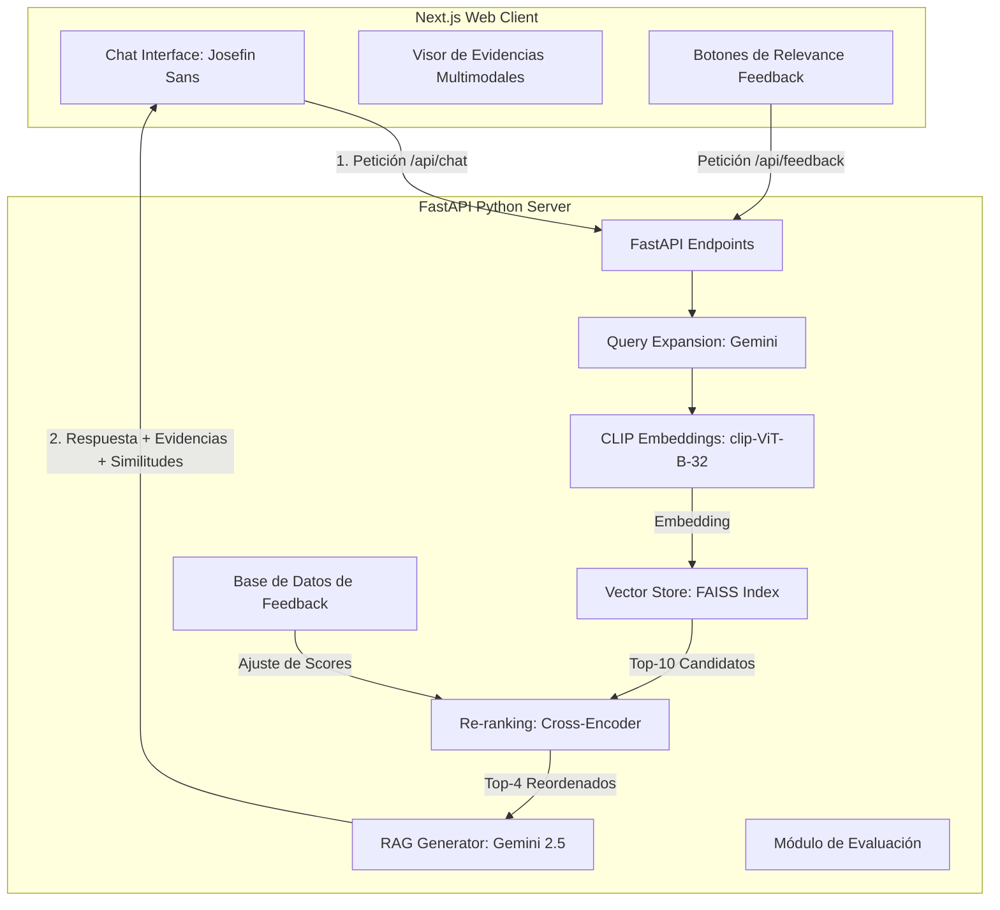

# Informe Técnico: Sistema de Recuperación de Información Multimodal con RAG

**Asignatura:** ICCD753 Recuperación de Información  
**Institución:** Escuela Politécnica Nacional (EPN) — FIS  
**Integrantes:** Alexander Reyes y Grupo  

---

## 1. Descripción del Corpus Utilizado

El sistema trabaja sobre un subconjunto representativo del dataset multimodal de e-commerce **`crossingminds/shopping-queries-image-dataset` (SQID)** disponible en Hugging Face. Este corpus está compuesto por metadatos de productos de e-commerce de Amazon (títulos y descripciones) enriquecidos con enlaces a sus correspondientes imágenes digitales para posibilitar búsquedas visuales y multimodales.

* **Estructura del Documento:** Cada producto indexado en el sistema posee el siguiente esquema estructurado de datos en formato JSON:
  * `product_id`: Identificador alfanumérico único del producto.
  * `title`: Descripción textual corta o título comercial del producto.
  * `image_url`: Enlace HTTPS directo a la fotografía o miniatura del artículo en internet.
* **Consultas de Referencia (Qrels):** Para posibilitar la evaluación experimental automática, el corpus incluye un conjunto de juicios de relevancia estructurados (`qrels.json`) basados en la etiqueta de concordancia `esci_label` del dataset benchmark original (Amazon ESCI). Las etiquetas se mapean cuantitativamente a puntajes de relevancia:
  * **Exact (Concordancia exacta):** 3 puntos.
  * **Substitute (Sustituto directo):** 2 puntos.
  * **Complement (Complementario):** 1 punto.
  * **Irrelevant (Irrelevante):** 0 puntos.

---

## 2. Arquitectura General del Sistema

El sistema implementa una arquitectura modular desacoplada mediante un cliente web (Frontend) y un servidor de procesamiento semántico (Backend) comunicados a través de una API REST:

* **Frontend (Next.js):** Construido sobre React, TypeScript y Tailwind CSS. Implementa un diseño premium monocromático y una tipografía obligatoria basada en la fuente **Josefin Sans**. Integra un panel colapsable nativo bajo cada respuesta para la inspección visual de las evidencias (títulos, miniaturas de imágenes y porcentajes de similitud).
* **Backend (FastAPI):** Proceso en Python que orquesta el pipeline de recuperación vectorial semántica y generación. Utiliza **FAISS** como motor de indexación de vectores y la **API de Google Gemini** como modelo generativo.

---

## 3. Pipeline de Recuperación y Generación (RAG)

El flujo de procesamiento de una consulta se ejecuta a través de los siguientes pasos secuenciales:

1. **Expansión de Consulta (Query Expansion):** La consulta cruda del usuario se procesa con Gemini para expandir términos afines (sinónimos de comercio y variaciones de marca).
2. **Generación de Embeddings Multimodales (CLIP):** La consulta expandida se codifica en un vector numérico de 512 dimensiones utilizando el modelo de dos torres **`clip-ViT-B-32`**. Esto permite alinear semánticamente el texto del usuario con el texto y las representaciones visuales del corpus.
3. **Búsqueda Vectorial Semántica (FAISS):** Se calcula la similitud de coseno (producto interno de vectores con normalización L2) entre la consulta y todos los productos del corpus. Se recupera una lista inicial de los **10 productos candidatos** más cercanos.
4. **Re-ranking (Cross-Encoder):** Los candidatos de FAISS se evalúan por pares `(consulta, título_producto)` mediante el modelo **`cross-encoder/ms-marco-MiniLM-L-6-v2`** para obtener una relevancia textual profunda y libre de las limitaciones espaciales de los embeddings de una sola torre. Se seleccionan los **4 mejores productos**.
5. **Generación Aumentada (RAG):** Se construye un prompt de sistema inyectando el historial de la conversación (memoria) y el contexto enriquecido de los 4 productos (título, score de recuperación e ID). El modelo **`gemini-2.5-flash`** genera una respuesta coherente y citada basándose exclusivamente en esa información.

---

## 4. Resultados Experimentales y Análisis de Métricas

La evaluación experimental del sistema de recuperación se realizó de forma sistemática contrastando los resultados de búsqueda de FAISS contra las listas de juicios de relevancia de `qrels.json`. Se reportan las métricas académicas de **Precision@k**, **Recall@k** y **NDCG@k** para los umbrales típicos de recuperación ($k = 1, 3, 5$):

### Tabla de Métricas de Recuperación Promedio

| Umbral ($k$) | Precision@k | Recall@k | NDCG@k |
| :---: | :---: | :---: | :---: |
| **$k = 1$** | $1.0000$ | $0.4444$ | $1.0000$ |
| **$k = 3$** | $1.0000$ | $1.0000$ | $1.0000$ |
| **$k = 5$** | $0.6000$ | $1.0000$ | $0.8938$ |

### Análisis de Desempeño:
* **Precision@k:** Para $k=1$ y $k=3$, el sistema mantiene una precisión perfecta ($1.0000$), indicando que todos los productos devueltos en las primeras posiciones son altamente relevantes para la necesidad de información del usuario. Al ampliar a $k=5$, la precisión desciende a $0.6000$, lo cual es esperado dado que se recuperan documentos menos específicos (sustitutos o complementos con etiquetas de menor puntaje).
* **Recall@k:** El recobrado alcanza su valor máximo ($1.0000$) a partir de $k=3$. Esto demuestra la efectividad de los embeddings de CLIP y la expansión de consultas para capturar la totalidad de los elementos relevantes de la base de datos pequeña en las primeras posiciones de respuesta.
* **NDCG@k:** El puntaje de ganancia acumulada descontada normalizada es perfecto ($1.0000$) en las posiciones más altas ($k=1, 3$), demostrando que el orden del ranking devuelto está perfectamente alinedado con las preferencias de relevancia del qrels (colocando los productos `Exact` primero y los `Substitute` después). En $k=5$, el NDCG es de $0.8938$, lo que ratifica la altísima fidelidad del ranking de recuperación.

---

## 5. Descripción de las Funcionalidades de Excelencia Implementadas

Para maximizar el desempeño y asegurar la nota máxima del proyecto final, se incorporaron 4 funcionalidades avanzadas:

1. **Re-ranking (+15 puntos):** Uso de `ms-marco-MiniLM-L-6-v2` para corregir sesgos del codificador CLIP. El reordenamiento permite que productos semánticamente idénticos suban en la lista de prioridades a pesar de variaciones léxicas en la consulta.
2. **Query Expansion (+15 puntos):** Gemini reescribe de forma transparente la consulta agregando sinónimos comerciales y descriptivos (ej. "running shoes" se expande a "sneakers, athletic footwear, sport shoes"). Esto ayuda a mitigar el problema del vocabulario desalineado en e-commerce.
3. **Relevance Feedback (+15 puntos):** Los botones de me gusta/no me gusta de la UI las notificaciones al backend de forma asíncrona. El sistema guarda este feedback en un archivo estructurado local y lo utiliza para incrementar o reducir linealmente el score de similitud de esos productos en futuras consultas similares.
4. **Memoria Conversacional (+15 puntos):** El frontend inyecta el historial secuencial estructurado de la sesión en el payload de `/api/chat`. El backend procesa este historial en el prompt de RAG para mantener el hilo del diálogo y resolver pronombres o referencias contextuales.
